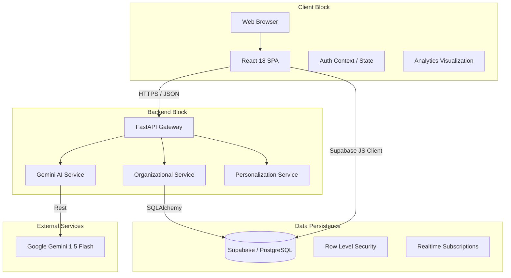
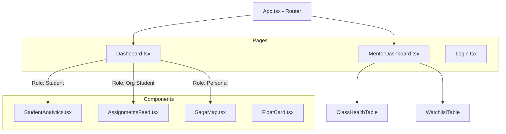
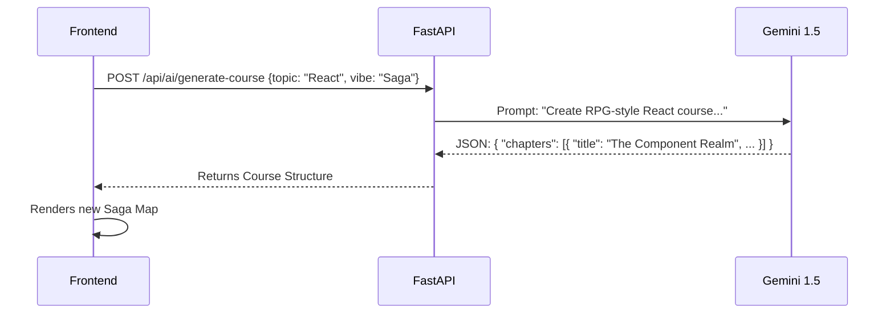
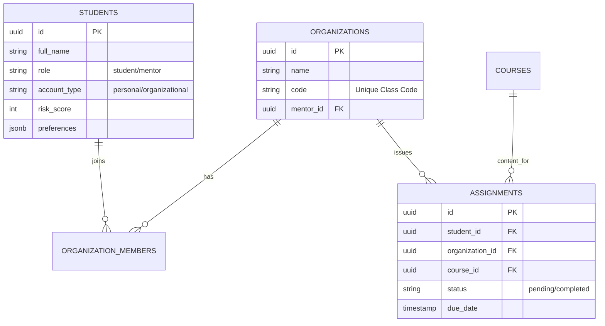

# 🎓 Adaptive Learning Platform & Organizational Tracker
### *Enterprise-Grade AI Learning Management System*

---

## 📑 Detailed Table of Contents
1.  [Executive Summary](#-executive-summary)
2.  [System Architecture & Technology Stack](#-system-architecture--technology-stack)
3.  [Frontend Application Architecture](#-frontend-application-architecture)
    *   [Component Hierarchy](#component-hierarchy)
    *   [State Management](#state-management)
    *   [Dashboard Specifications](#dashboard-specifications)
4.  [Backend Services & API Layer](#-backend-services--api-layer)
    *   [Service Layer Design](#service-layer-design)
    *   [API Endpoints Breakdown](#api-endpoints-breakdown)
    *   [AI Integration Flow](#ai-integration-flow)
5.  [Database Schema & Data Model](#-database-schema--data-model)
6.  [Key Workflows & Logic](#-key-workflows--logic)
    *   [Authentication & Role-Based Access](#authentication--role-based-access)
    *   [Live Analytics Engine](#live-analytics-engine)
    *   [Organizational Assignment Logic](#organizational-assignment-logic)
7.  [Setup & Deployment Guide](#-setup--deployment-guide)

---

## 🚀 Executive Summary

The **Adaptive Learning Platform** is a dual-purpose educational system designed to bridge the gap between **Personalized Self-Paced Learning** and **Curriculum-Based Organizational Training**.

*   **For Independent Learners**: It uses **Generative AI (Gemini 1.5)** to create dynamic "Sagas" (courses) tailored to user "Vibes" (e.g., RPG-style, Academic, Bootcamp).
*   **For Organizations (Schools/Companies)**: It provides a rigid "Organizational Track" where Mentors manage rosters, assign mandatory content, and monitor risk via high-frequency analytics.

**Key Innovation**: The platform features a **Real-Time Deterministic Analytics Engine** that visualizes "Live Progress" by correlating global clickstream data with completed credit units, providing immediate feedback loops for students and predictive risk modeling for mentors.

---

## 🏗 System Architecture & Technology Stack

### Application Layer Diagram


### Technology Matrix
| Layer | Technology | Version | Rationale |
| :--- | :--- | :--- | :--- |
| **Frontend** | React + Vite | 18.x | High-performance SPA with fast HMR. |
| **Styling** | Tailwind CSS | 3.x | Utility-first for rapid, consistent UI "Solar Flare" theme. |
| **Backend** | Python FastAPI | 0.109+ | Async performance, native Pydantic support for AI JSON schemas. |
| **Database** | PostgreSQL | 15.x | Relational integrity for complex assignment/student mapping. |
| **AI Model** | Gemini 1.5 Flash | Latest | Low latency, high token limit for generating large course outlines. |
| **Charts** | Recharts | 2.x | Composable React components for D3-based visualizations. |

---

## 🖥 Frontend Application Architecture

### Component Hierarchy
The UI is structured around a "Smart/Dumb" component pattern with a layout wrapper.



### Dashboard Specifications

#### 1. Student Dashboard (`Dashboard.tsx`)
*   **Purpose**: The central hub for learning.
*   **Dynamic Layout**:
    *   **Header**: Displays "Learning Journey" and Organization Name (if applicable).
    *   **Main Stage**:
        *   **Personal Users**: See `SagaMap` (Interactive node map) or `BootcampView` (Grid).
        *   **Organizational Users**: See `AssignmentsFeed` (List of mandatory tasks).
    *   **Right Panel (HUD)**:
        *   `StudentAnalytics`: Live Pie/Donut chart.
        *   `QuestLog`: Daily interactive checklist.

#### 2. Mentor Dashboard (`MentorDashboard.tsx`)
*   **Purpose**: Command center for instructors.
*   **Widgets**:
    *   **Class Health KPIs**: "Avg Engagement %", "Completion Rate", "At-Risk Count".
    *   **Watchlist**: Table highlighting students with `risk_score > 70` (Red highlight).
    *   **Assignment Manager**: Dropdown to select a course and "Assign to Class".

#### 3. Student Analytics (`StudentAnalytics.tsx`)
*   **Logic**:
    *   `Studied Credits`: Prop passed from parent (`completed_quests * 10` + `manual_credits`).
    *   `Total Clicks`: Global `document.addEventListener` counts every interaction as an engagement proxy.
    *   **Demo Mode**: If `credits == 0` on mount, a `setInterval` loop simulates progress (0 -> 30) to wow the user.
*   **Visuals**: Recharts `PieChart` (Donut variant) showing achieved credits vs goal.

---

## 🔧 Backend Services & API Layer

### Service Layer Design

#### 1. `GeminiService` (`backend/app/services/gemini.py`)
Responsible for all generative content.
*   **Prompt Strategy**: Uses strict JSON output forcing.
*   **Functions**:
    *   `generate_course_outline(topic, vibe)`: Returns detailed JSON syllabus.
    *   `generate_quiz(context)`: Returns questions with correct/incorrect rationales.

#### 2. `OrgService` (`frontend/src/services/orgService.ts`)
*Note: This service lives in the Frontend to leverage Supabase Client directly for RLS efficiency.*
*   **Functions**:
    *   `joinClass(code)`: Validates code -> Inserts into `organization_members`.
    *   `getOrgStudents(orgId)`: Joins `students` table to fetch names/activity.
    *   `assignCourse(orgId, courseId)`: Bulk inserts into `assignments` table.

### AI Integration Flow


---

## 💾 Database Schema & Data Model

We use a normalized relational schema on PostgreSQL.

### Entity-Relationship Diagram (ERD)



### Table Dictionary
*   **`students`**: The core user record. `role` determines access to `/mentor` routes. `account_type` toggles the dashboard view.
*   **`assignments`**: Critical for the Organizational track. Tracks `status` and `due_date`.
*   **`organization_members`**: Linking table. A student can belong to an org.

---

## 🗝 Key Workflows & Logic

### 1. Authentication & Role-Based Access
*   **Logic**: Supabase Auth handles the session.
*   **Authorization**:
    *   On login, we fetch the `students` record.
    *   If `role === 'mentor'`, the UI enables the "Mentor Dashboard" link.
    *   If `account_type === 'organizational'`, the "Generate Course" button is **hidden**, and the Main View switches to `AssignmentsFeed`.

### 2. Live Analytics Engine
The goal is to show immediate reactivity.
*   **Inputs**:
    *   `Studied Credits`: From Quest Completion (10 per quest) + Manual "Start Assignment" (5 per click).
    *   `Global Clicks`: Raw count of user interactions.
*   **Processing**:
    *   React `useEffect` hooks listen for these changes.
    *   If `credits` changes, the Pie Chart re-renders with animation.
    *   Total Clicks acts as a "heartbeat" counter in the UI.

### 3. Organizational Assignment Logic
How a teacher blasts a course to 30 students:
1.  **Selection**: Teacher picks "React Basics" from dropdown.
2.  **Action**: Clicks "Assign to Class".
3.  **Backend Execution**:
    *   Fetch all `student_id`s from `organization_members` where `org_id = X`.
    *   Map to array of Assignment objects.
    *   Perform `supabase.from('assignments').insert(array)` (Batch Insert).
4.  **Result**: Students immediately see the new card in `AssignmentsFeed`.

---

## 🛠 Setup & Deployment Guide

### Prerequisites
*   Node.js v18+
*   Python 3.10+
*   Supabase Account (Free Tier works)
*   Google Gemini API Key

### Installation Steps

1.  **Clone the Repository**
    ```bash
    git clone https://github.com/aryan152005/adaptive-learning.git
    cd adaptive-learning
    ```

2.  **Database Setup (Supabase)**
    *   Copy the contents of `backend/db/complete_schema.sql` and `backend/db/org_schema.sql`.
    *   Run them in your Supabase SQL Editor to create tables and policies.

3.  **Backend Config**
    ```bash
    cd backend
    pip install -r requirements.txt
    # Create .env file with:
    # GEMINI_API_KEY=xyz
    # SUPABASE_URL=xyz
    # SUPABASE_KEY=xyz
    uvicorn app.main:app --reload
    ```

4.  **Frontend Config**
    ```bash
    cd frontend
    npm install
    # Create .env.local with Supabase keys
    npm run dev
    ```

5.  **Access**
    *   Open `http://localhost:5173`.
    *   Login as Mentor (set `role='mentor'` in DB) or Student.

---

**Generated by Antigravity Agent** 🚀
*Last Updated: Dec 19, 2025*
