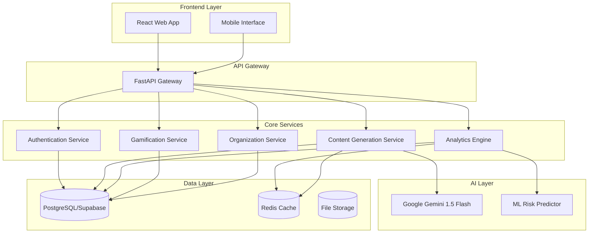
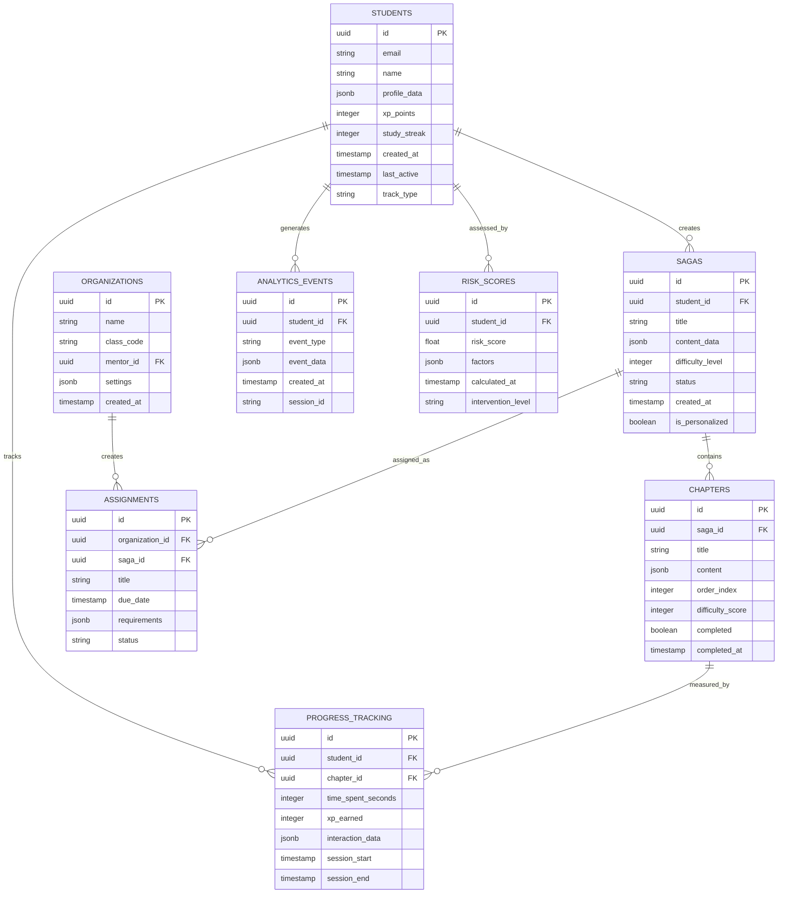

# Design Document: AI-Powered Adaptive Learning Platform

## Overview

The AI-Powered Adaptive Learning Platform is a sophisticated education technology system that leverages artificial intelligence to deliver personalized learning experiences through a dual-path architecture. The system combines AI-generated content with real-time analytics, gamification, and organizational management capabilities to create an adaptive learning environment that scales from individual learners to institutional deployments.

The platform's core innovation lies in its deterministic analytics engine that correlates clickstream data with learning outcomes, enabling predictive risk modeling and personalized content generation. The dual-path approach allows the system to serve both independent learners seeking personalized AI-generated learning journeys and organizations requiring structured curriculum management with mentor oversight.

## Architecture

### High-Level Architecture

The system follows a modern microservices architecture with clear separation of concerns:

### Service Architecture Patterns

The platform implements several key architectural patterns:

1. **Modular AI System Design**: AI capabilities are treated as independent, interchangeable building blocks including content generation, personalization, and risk assessment
2. **Event-Driven Architecture**: Real-time analytics and progress tracking use event streaming for immediate response
3. **Multi-Tenant Architecture**: Row Level Security (RLS) policies ensure data isolation between organizations and users
4. **Microservices with API Gateway**: FastAPI serves as the central gateway with service-specific endpoints

## Components and Interfaces

### Frontend Components

**React Application Structure:**
- **Personal Track Interface**: AI-generated saga progression, study room tools, progress visualization
- **Organizational Track Interface**: Mentor dashboards, class management, bulk assignment tools
- **Shared Components**: Authentication, profile management, responsive navigation
- **Accessibility Layer**: WCAG 2.1 AA compliance with keyboard navigation and screen reader support

**Technology Stack:**
- React 18 with TypeScript for type safety
- Vite for fast development and building
- Tailwind CSS with glassmorphic design and neon accents
- Mobile-first responsive design

### Backend Services

**Authentication Service:**
- Supabase Auth integration with email/password authentication
- JWT token management with secure session handling
- Role-based access control (Student, Mentor, Admin)
- Multi-tenant user isolation

**Content Generation Service:**
- Google Gemini 1.5 Flash API integration
- Personalization engine considering skill level, goals, pace, interests
- Saga generation with RPG-style progression
- Difficulty mapping on 0-100 scale
- Fallback content system for API failures

**Analytics Engine:**
- Real-time clickstream data processing
- Deterministic correlation with completed credits
- ML-based risk scoring for student intervention
- Dashboard data aggregation with 5-second update cycles
- Event streaming for immediate analytics updates

**Gamification Service:**
- XP point calculation based on difficulty and performance
- Study streak tracking and milestone achievements
- Progress visualization and reward systems
- Leaderboard management for organizational contexts

**Organization Service:**
- Class code generation and management
- Bulk assignment distribution
- Mentor dashboard data aggregation
- Hierarchical access control enforcement

### AI Integration Layer

**Google Gemini 1.5 Flash Integration:**
- Content generation with context-aware prompting
- Personalization based on student profiles
- Multi-tool study room functionality (explain, quiz, visualize, socratic)
- Exponential backoff retry mechanisms
- Rate limiting and quota management

**ML Risk Predictor:**
- Real-time behavioral pattern analysis
- Predictive modeling for student intervention
- Correlation analysis between engagement and outcomes
- Automated alert generation for at-risk students

## Data Models

### Core Entity Relationships

### Data Model Specifications

**Students Table:**
- Primary entity for all learners
- Profile data includes skill level, learning goals, pace preferences, interests
- XP points and study streaks for gamification
- Track type distinguishes between Personal and Organizational users
- RLS policies ensure data isolation

**Sagas and Chapters:**
- Hierarchical content structure with progressive difficulty
- Personalized sagas generated by AI based on student profiles
- Default sagas available as fallback content
- Completion tracking with timestamps for analytics

**Progress Tracking:**
- Granular session data with time spent and XP earned
- Interaction data captures clickstream for analytics
- Real-time updates for immediate progress reflection

**Analytics and Risk Assessment:**
- Event-driven data collection for all user interactions
- ML-based risk scoring with configurable intervention thresholds
- Historical data retention for trend analysis

### Row Level Security Policies

**Multi-Tenant Data Isolation:**
- Students can only access their own data and assigned organizational content
- Mentors can access data for students in their organizations
- Administrators have full access within their organizational scope
- Cross-tenant data leakage prevention through RLS enforcement

## Correctness Properties

*A property is a characteristic or behavior that should hold true across all valid executions of a system—essentially, a formal statement about what the system should do. Properties serve as the bridge between human-readable specifications and machine-verifiable correctness guarantees.*

Before defining the correctness properties, I need to analyze the acceptance criteria from the requirements to determine which are testable as properties, examples, or edge cases.

### Property 1: Track Selection Enables Appropriate Features
*For any* user selecting Personal Track, the system should enable AI-generated personalized learning journeys, and for any user selecting Organizational Track, the system should enable structured curriculum management with mentor access.
**Validates: Requirements 1.2, 1.3**

### Property 2: Data Isolation Through RLS Policies
*For any* user and any data access operation, the system should enforce Row Level Security policies to prevent cross-tenant data access and maintain isolation between Personal and Organizational tracks.
**Validates: Requirements 1.4, 6.4, 8.3**

### Property 3: Progress Preservation During Track Switching
*For any* user switching between tracks, all existing progress data, XP points, and learning history should remain intact and accessible after the switch.
**Validates: Requirements 1.5**

### Property 4: AI Content Generation with Personalization
*For any* content generation request, the system should use Google Gemini 1.5 Flash API and include skill level, learning goals, pace, and interests in the personalization parameters.
**Validates: Requirements 2.1, 2.2**

### Property 5: Progressive Difficulty in Sagas
*For any* generated saga, the chapters should be ordered with non-decreasing difficulty scores, creating a progressive learning path.
**Validates: Requirements 2.3**

### Property 6: Content Difficulty Mapping
*For any* piece of learning content, the difficulty score should be within the range of 0-100 inclusive.
**Validates: Requirements 2.4**

### Property 7: Fallback Content Provision
*For any* AI generation failure, the system should provide fallback content within 10 seconds of the failure detection.
**Validates: Requirements 2.5**

### Property 8: Content Generation Performance
*For any* user request for new content, the system should complete generation and delivery within 10 seconds.
**Validates: Requirements 2.6**

### Property 9: Real-time Analytics Correlation
*For any* student clickstream event, the analytics engine should correlate it with completed credits and update analytics data in real-time.
**Validates: Requirements 3.1**

### Property 10: Risk Score Generation
*For any* student behavioral analysis, the risk predictor should generate an ML-based risk score with associated factors.
**Validates: Requirements 3.2**

### Property 11: Intervention Alert Triggering
*For any* risk score that exceeds the configured threshold, the system should trigger appropriate intervention alerts.
**Validates: Requirements 3.3**

### Property 12: Dashboard Update Performance
*For any* student activity event, analytics dashboards should reflect the update within 5 seconds.
**Validates: Requirements 3.4**

### Property 13: Deterministic Analytics Accuracy
*For any* analytics report generation, the calculations should be deterministic and achieve 99% accuracy when compared to ground truth data.
**Validates: Requirements 3.5**

### Property 14: XP Award Calculation
*For any* completed learning activity, the XP points awarded should correlate positively with both difficulty level and performance metrics.
**Validates: Requirements 4.1**

### Property 15: Study Streak Maintenance
*For any* student's learning sessions, the system should accurately track and maintain study streak counters based on consecutive learning days.
**Validates: Requirements 4.2**

### Property 16: Milestone Progress Indicators
*For any* student achieving a learning milestone, the system should provide visual progress indicators in the user interface.
**Validates: Requirements 4.3**

### Property 17: Immediate Progress Persistence
*For any* XP gain or progress update, the data should be persisted to the database immediately without waiting for batch operations.
**Validates: Requirements 4.4**

### Property 18: Progress Display Completeness
*For any* progress display request, the interface should show time spent, chapters completed, and skill improvements.
**Validates: Requirements 4.5**

### Property 19: Adaptive Quiz Generation
*For any* current learning content, the study room should generate quizzes that are adapted to the content's difficulty and topic.
**Validates: Requirements 5.2**

### Property 20: Concept Visualization
*For any* complex concept in the learning content, the study room should create appropriate visual representations.
**Validates: Requirements 5.3**

### Property 21: Socratic Questioning Sessions
*For any* learning session, the study room should conduct Socratic questioning to deepen student understanding.
**Validates: Requirements 5.4**

### Property 22: Study Tool Fallback
*For any* study tool failure, the system should provide alternative study methods within 5 seconds.
**Validates: Requirements 5.5**

### Property 23: Unique Class Code Generation
*For any* organizational enrollment, the system should generate class codes that are unique across all organizations.
**Validates: Requirements 6.1**

### Property 24: Bulk Assignment Capability
*For any* mentor creating assignments, the system should enable assignment to multiple students simultaneously.
**Validates: Requirements 6.2**

### Property 25: Organizational Hierarchy Access Control
*For any* organizational structure, the system should enforce appropriate access controls based on hierarchical relationships.
**Validates: Requirements 6.5**

### Property 26: Page Load Performance
*For any* page load request, the initial page should complete loading within 3 seconds.
**Validates: Requirements 7.2**

### Property 27: AI Generation Performance
*For any* AI content generation request, the system should complete generation within 10 seconds.
**Validates: Requirements 7.3**

### Property 28: Data Encryption in Transit
*For any* data transmission, the system should use TLS 1.3 encryption to protect data in transit.
**Validates: Requirements 8.1**

### Property 29: Data Encryption at Rest
*For any* sensitive data storage, the system should use AES-256 encryption to protect data at rest.
**Validates: Requirements 8.2**

### Property 30: Input Validation and Sanitization
*For any* user input processing, the system should validate and sanitize all inputs before processing.
**Validates: Requirements 8.4**

### Property 31: Secure Authentication
*For any* user authentication, the system should use Supabase Auth with secure session management.
**Validates: Requirements 8.5**

### Property 32: WCAG Accessibility Compliance
*For any* user interface element, the system should comply with WCAG 2.1 AA accessibility standards.
**Validates: Requirements 9.1**

### Property 33: Responsive Design
*For any* device or screen size, the system should provide mobile-first responsive design that adapts appropriately.
**Validates: Requirements 9.2**

### Property 34: Consistent Visual Design
*For any* UI rendering, the system should use glassmorphic design elements with neon accents consistently.
**Validates: Requirements 9.3**

### Property 35: Keyboard Navigation Support
*For any* interactive element, the system should support keyboard navigation for accessibility.
**Validates: Requirements 9.4**

### Property 36: Screen Reader Compatibility
*For any* content display, the system should provide screen reader compatibility.
**Validates: Requirements 9.5**

### Property 37: External API Integration
*For any* AI content generation, the system should successfully integrate with Google Gemini 1.5 Flash API.
**Validates: Requirements 10.1**

### Property 38: Supabase Service Integration
*For any* database, authentication, or real-time operation, the system should use appropriate Supabase services.
**Validates: Requirements 10.2**

### Property 39: API Retry Mechanisms
*For any* external API call failure, the system should implement exponential backoff retry mechanisms.
**Validates: Requirements 10.3**

### Property 40: API Rate Limiting
*For any* API usage, the system should monitor usage and implement rate limiting to prevent quota exhaustion.
**Validates: Requirements 10.4**

### Property 41: Service Resilience
*For any* external API unavailability, the system should maintain service availability through fallback mechanisms.
**Validates: Requirements 10.5**

## Error Handling

The system implements comprehensive error handling across all layers:

### AI Service Error Handling
- **Gemini API Failures**: Exponential backoff retry with circuit breaker pattern
- **Content Generation Timeouts**: Fallback to pre-generated content library
- **Rate Limit Exceeded**: Queue requests with priority-based processing
- **Invalid API Responses**: Content validation with error logging and fallback

### Database Error Handling
- **Connection Failures**: Connection pooling with automatic retry
- **Transaction Failures**: Rollback with user notification and retry options
- **RLS Policy Violations**: Secure error messages without data exposure
- **Data Validation Errors**: User-friendly error messages with correction guidance

### Real-time Analytics Error Handling
- **Event Processing Failures**: Dead letter queue for failed events
- **ML Model Failures**: Fallback to rule-based risk assessment
- **Dashboard Update Failures**: Cached data with refresh indicators
- **Data Correlation Errors**: Logging with manual review triggers

### User Interface Error Handling
- **Network Connectivity Issues**: Offline mode with data synchronization
- **Authentication Failures**: Clear error messages with recovery options
- **Form Validation Errors**: Real-time validation with helpful guidance
- **Accessibility Errors**: Graceful degradation with alternative access methods

## Testing Strategy

The testing strategy employs a dual approach combining unit testing for specific scenarios with property-based testing for universal correctness validation.

### Property-Based Testing Configuration

**Testing Framework**: The system will use Hypothesis (Python) for backend property tests and fast-check (TypeScript) for frontend property tests.

**Test Configuration**:
- Minimum 100 iterations per property test to ensure comprehensive input coverage
- Each property test tagged with format: **Feature: adaptive-learning-platform, Property {number}: {property_text}**
- Randomized test data generation for comprehensive edge case coverage
- Deterministic seed configuration for reproducible test results

**Property Test Implementation**:
- Each correctness property implemented as a single property-based test
- Universal quantification validated through generated test cases
- Requirements traceability maintained through test tags
- Automated property test execution in CI/CD pipeline

### Unit Testing Strategy

**Unit Test Focus Areas**:
- Specific examples demonstrating correct behavior
- Integration points between microservices
- Edge cases and error conditions not covered by property tests
- API contract validation and response handling

**Testing Balance**:
- Property tests handle comprehensive input coverage and universal correctness
- Unit tests focus on concrete examples and integration scenarios
- Combined approach ensures both general correctness and specific functionality

**Test Coverage Requirements**:
- 90% code coverage for core business logic
- 100% coverage for security-critical functions
- Integration test coverage for all external API interactions
- End-to-end test coverage for critical user journeys

### Performance Testing

**Load Testing**:
- Concurrent user simulation up to 1000+ users
- AI content generation performance under load
- Database query performance with large datasets
- Real-time analytics processing under high event volumes

**Performance Benchmarks**:
- Page load times consistently under 3 seconds
- AI content generation under 10 seconds
- Dashboard updates within 5 seconds of events
- API response times under 200ms for non-AI operations